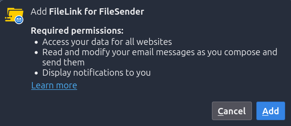
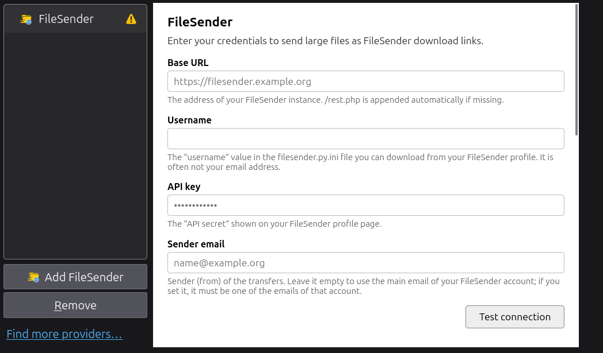

# FileLink for FileSender

  

A Thunderbird add-on that attaches large files to your emails as
[FileSender](https://filesender.org) download links instead of attaching them directly.
It works with any FileSender instance you have an account on.

## What it does

- Adds "FileSender" as a FileLink provider in the attachment menu.
- Uploads the file to your FileSender instance and puts a download link in the mail
  instead of the file itself.
- Lets you set an expiry date, notifications and password encryption before each upload
  (or use saved defaults).
- Reuses a link you already sent when you attach the same file again, as long as it is
  still valid.

## Requirements

- Thunderbird 128 or later.
- An account on a FileSender instance, with its REST API enabled for you.

## Getting your FileSender credentials

The add-on needs three values: the instance's base URL, your identifier and your API
key. Find the last two on your FileSender instance's own account settings page:

1. Open `/?s=user` (or find "Account settings" in the menu).
2. Top right, "Account information": the "Identifier" field. It is often not your email
   address.
3. Bottom left, "Remote authentication": the "API secret" field.

Use those two values, plus the instance's base URL, in the add-on's settings (see
"Configuration" below).

## Installation

Thunderbird does not require add-ons to be signed, so the `.xpi` can be installed
permanently without going through addons.thunderbird.net:

1. Download `filelink-for-filesender-<version>.xpi` from the
   [releases page](https://github.com/ConsortiumGARR/filelink-for-filesender/releases).
2. In Thunderbird, open "Add-ons and Themes" (Ctrl+Shift+A).
3. Gear menu (top right) -> "Install Add-on From File..." and pick the `.xpi` file.
4. Accept the permissions prompt:

   

     
   

   - **Access your data for all websites**: the `https://*/*` host permission.
     FileSender is self-hosted and sends no CORS headers, so the add-on needs a broad
     permission to reach whichever instance you configure; it only ever contacts that
     one instance.
   - **Read and modify your email messages as you compose and send them**: the
     `compose` permission, used only to know whether a mail was sent, saved or
     discarded, so that transfers left over from a discarded mail are deleted from
     FileSender. The add-on never reads or modifies the mail content.
   - **Display notifications to you**: used for information you don't have to act on,
     such as an upload option the server did not apply. Anything you must decide on
     opens a window instead.

Unlike a temporary add-on, this install survives a Thunderbird restart; to update, just
repeat these steps with the new `.xpi`.

## Configuration

1. Settings -> Composition -> "Attachments" -> "Add FileSender". Click the new entry's
   name to rename it, e.g. if you configure more than one FileSender instance.
2. Select the account in the list: the settings page opens on the right.

   

     
   

3. Fill in the base URL, identifier and API key from "Getting your FileSender
   credentials" above; optionally a sender email. Click "Test connection".
4. Tick the terms of use, adjust the default upload options if you want, and save.

## Usage

1. Write a mail, click Attach -> FileLink -> "FileSender" -> pick one or more files.
2. If asked, set the expiry, notifications and optional password, then click "Upload".
3. Each file becomes a FileSender link in the mail, with its expiry date (and "password
   protected" when encrypted). The password is never stored nor put in the mail: send it
   to the recipients separately.
4. To reuse a file you already sent, pick it again from the attach menu; a new upload
   starts only if the previous link is no longer valid.

## Development

### Normal development

Everything is plain JS/HTML/CSS/JSON, no bundler or transpiler; edit files under `src/`
directly, then build and reload as below. General background on Thunderbird add-ons:
<https://developer.thunderbird.net/add-ons/about-add-ons>.

### Build

`sh tools/build.sh` zips `src/` into `dist/*.xpi`. While developing, load it as a
temporary add-on instead of installing it: Add-ons and Themes -> gear menu -> "Debug
Add-ons" -> "Load Temporary Add-on" -> pick the `.xpi`. That gives you "Inspect"
(console, "Persist Logs") on the running extension; loading `src/manifest.json`
directly does not work.

### Internationalization

UI strings live in `src/_locales/<language>/messages.json` (English is the default,
Italian is also available); never hardcode UI text in JS or HTML. See
[TRANSLATIONS.md](TRANSLATIONS.md) for how to add a language.

### Tests

`sh test/check.sh` runs everything (static checks, signing, encryption, request
retries, background logic, formatting). The JS tests run on Node: a local `node` is
used if present, otherwise a disposable `node:24-alpine` container, so nothing needs
installing either way. See [docs/TESTING.md](docs/TESTING.md) for the full plan,
including manual testing in Thunderbird.

### Formatting

`sh tools/format.sh` (black + ruff for Python, Prettier for the extension's
JS/HTML/JSON/CSS); `sh tools/format.sh --check` only verifies.

### Releasing

See [docs/RELEASING.md](docs/RELEASING.md) for cutting a release (GitHub Releases,
already automated) and submitting it to addons.thunderbird.net, both the first time and
for later updates.

### AI-assisted development

[AGENTS.md](AGENTS.md) is the authoritative guide for AI coding agents working in this
repo. For anything touching a Thunderbird `browser.*` API, also read
[reference/thunderbird-webextensions-skill.md](reference/thunderbird-webextensions-skill.md)
first (mirrored from
<https://github.com/thunderbird/webext-support/tree/master/ai>); never guess a
Thunderbird API's name or parameters.

## Troubleshooting

- **"FileSender is not configured"**: the settings were not saved, or a field is
  missing.
- **`auth_remote_signature_check_failed`**: wrong identifier or API key (FileSender gives
  the same error for both). Re-check the "Account information" and "Remote
  authentication" sections above and compare them with the saved settings.
- **Access to all websites permission**: FileSender sends no CORS headers, so the add-on
  needs a broad host permission to reach any self-hosted instance. Requests only ever go
  to the instance you configured.
- **Debug logs**: enable "Detailed logs in the console (debug)" in the account settings,
  then "Inspect" the add-on from "Add-ons and Themes" and open its Console (enable
  "Persist Logs"). API keys, tokens, signatures and email addresses are always masked,
  so logs can be pasted into a bug report.
